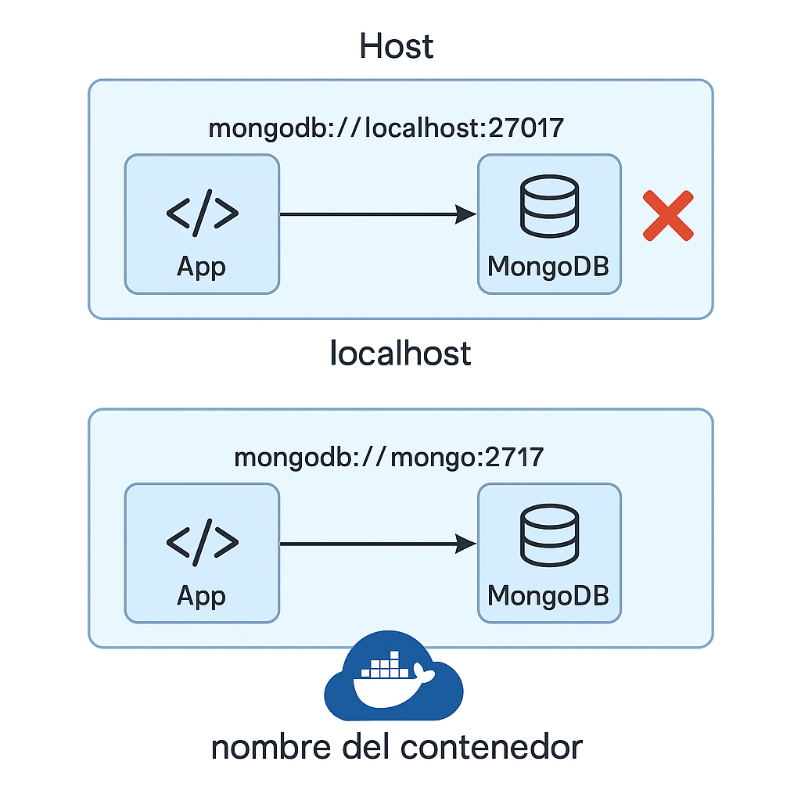

📚 Contenidos:
1. 🔌 Tipos de redes en Docker:
Bridge (por defecto): para comunicación entre contenedores en el mismo host.

Host: el contenedor usa directamente la red del host (sin NAT).

Overlay: para comunicación entre contenedores en hosts distintos (usado en Swarm).

None: sin red.

2. 🧪 Comandos clave:
# Listar redes
docker network ls

# Crear una red bridge personalizada
docker network create my-custom-network

# Ejecutar contenedor en red personalizada
docker run -d --name app1 --network my-custom-network nginx
docker run -d --name app2 --network my-custom-network alpine sleep 9999

# Probar conexión
docker exec -it app2 ping app1

3. 🔄 Ejercicio práctico (Exercise 05)
Objetivo: Crear 2 contenedores (una app Node y una base de datos como Mongo o MySQL) que se comuniquen a través de una red personalizada.

Archivos:
Dockerfile para la app

docker-compose.yml que conecte los servicios por nombre de contenedor

4. 🧠 Preguntas para reflexionar:
¿Qué pasa si no están en la misma red?

¿Cómo resolvemos nombres DNS entre contenedores?

¿Por qué usar docker-compose en lugar de docker run?

📚 Contenidos:
1. 🔌 Tipos de redes en Docker:
// ... rest of the existing content ...